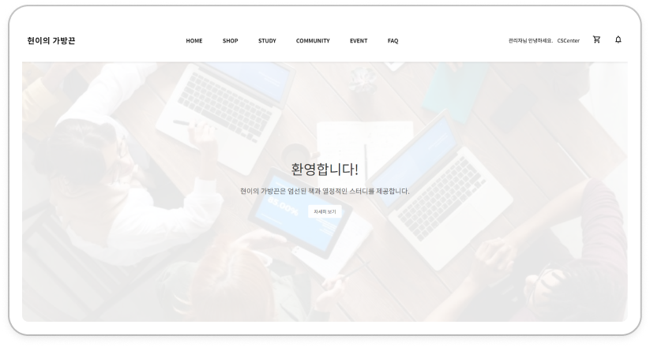
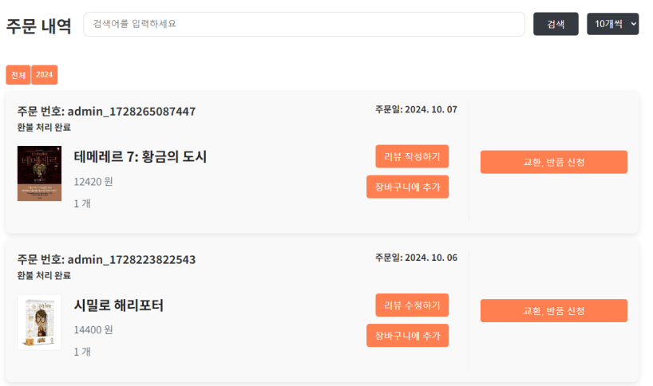
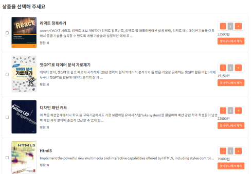
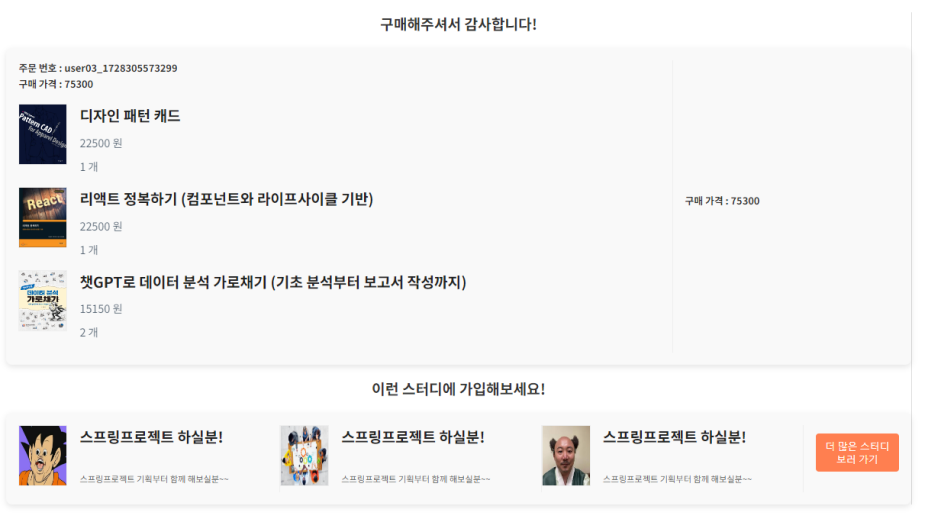

# 📚 프로젝트명: 현이의 가방끈

## 1. 프로젝트 개요

### 프로젝트 요약
'현이의 가방끈'은 스터디 그룹 생성, 커뮤니티,서적 판매 기능을 지원하는 웹 플랫폼입니다. 이 프로젝트는 사용자들이 스터디 그룹을 생성하고, 다른 사용자들과 자유롭게 소통하며, 필요한 학습 서적을 거래할 수 있는 종합적인 학습 지원 플랫폼을 목표로 하고 있습니다.

### 프로젝트 목표
> Session을 통한 안전한 로그인 인증 구현 
MVC 패턴을 이용한 비즈니스 로직 분리 
Mybatis를 통한 DB 관리 
Layout 분리를 통한 모듈화 및 일관된 사용자 경험 
API를 사용한 결제, 환불 시스템 구현

### 기술 스택

- **프론트엔드**: *Vue.js, HTML5, CSS3, JavaScript*
- **백엔드**: *Spring Framework, JSP*
- **HTTP 통신**: *AJAX*
- **API**: *Kakao 주소 API, Iamport 결제 연동 API*

## 2. 기능 설명

### 핵심 참여 기능

- **사용자 관리**: 로그인, 아이디 및 비밀번호 찾기
    - 로그인 시 session(memory 관리)을 통한 유저 정보 관리
- **SHOP**: 책 목록, 상세 페이지, 리뷰, 장바구니, 결제 등
    - DB에 저장된 책 정보를 리스트로 출력
    - 각 book_FK, user_FK 를 가진 리뷰 테이블로 리뷰 관리
    - 리스트, 상세 페이지에서 장바구니에 추가(기존 책이 있으면 권수 추가)
    - Iamport API를 통한 결제
    - 결제 전 상품 수량, 결제 신청 온 가격과 실제 상품의 가격 등을 비교하여 고객 경험 및 보안 강화
    - 각 이용자에게 필요한 정보(환불 신청 결과 등)에 맞는 알림 내역을 TRIGGER를 통해 Notification 레코드 생성
    - 환불 신청 시 관리자 계정으로 알림 -> 환불 수락여부 결정

### UI/UX 설명
> **홈 화면**: 
 인트로 페이지. 헤더를 통해 카테고리 이동을 하거나 하단에서 추천 책을 보여준다.

> **주문 내역**: 
 주문 한 책 리스트. 환불 신청 및 리뷰 작성 등이 가능하다.

> **장바구니**: 
 상품을 보관하고 결제할 수 있다. 0개 이하의 숫자로 내려가지 않는다.

> **결제 완료 페이지**: 
 결제 완료 후 페이지. 주문한 내역과 함께 카테고리에 속한 스터디를 추천해준다.
 

## 3. 프로젝트 구조

### 모놀리식 구조
SpringBoot로 프로젝트를 구축하고 MVC패턴을 통해 비즈니스 로직과 뷰를 분리하였습니다.
이를 통해 뷰, 모델 간의 결합도를 낮추고 테스트가 용이하게 만들었습니다.

- **Iamport API** 
 Iamport API를 활용하여 결제 및 환불 시스템을 구현하였습니다. 실제 결제가 이뤄지기 전에 사전 검증을 통해 변조 공격 등을 대비하고 DB에 있는 실제 재고 수량 역시 체크하여 고객 경험을 개선했습니다.

- **Session방식 로그인** 
 로드밸런싱이 없는 단일 서버에서 자주 사용되는 Session을 통한 사용자 인증 방식을 통해 로그인을 구현했습니다.

- **비동기 통신** 
 Ajax 통해 비동기 통신을 구현하여, 사용자가 페이지를 새로고침하지 않고도 데이터 업데이트를 실시간으로 반영할 수 있도록 하였습니다. 

## 4. 주요 기술적 문제와 해결 방법
1. **잘못된 구조에서 오는 렌더링 이슈** 
**문제:** 기존 배운 방식이 jsp와 vue 등을 조합해서 웹을 구현하는 잘못된 방식이었는데 당시 잘못된 것을 잘 알지 못해 include를 통해 모듈화를 진행했고 서버에서 데이터를 가져왔을 때 각 페이지에 vue 객체에 데이터 전달이 안되는 이슈가 있었습니다. 
**해결:** 구조를 변경하는 것이 가장 좋은 방법이었지만 당시 지식 수준의 부족함과 시간의 부족으로 인해 임시 방편으로 
sessionStorage에 값을 저장 및 dispatchEvent 메서드로 커스텀 이벤트를 생성 후 렌더링할 페이지에 eventListener를 생성하여 sessionStorage에 있는 정보를 불러와 해결하였습니다.

## 5. 배운 점/ 아쉬운 점
#### 아쉬운 점
- 당시 CSR, SSR 등의 개념이 명확하지 않고 Vue와 JSP 등의 혼용 등 기본적인 아키텍쳐에 대한 이해도가 없었던 점이 많이 아쉬웠습니다. 
- 초기 비즈니스 로직 설계 단계에서 결제나 환불 등 민감하고 복잡한 로직들에 대한 구체적인 설계가 이뤄지고 진행돼야하는데 그런 부분이 미흡하여 중간에 상황에 맞춰 어거지로 개발되어 로직이 명확하지 않은 부분들이 많습니다. 
기존의 기획이 있더라도 전체적인 참여도에 맞춰서 볼륨을 줄이고 로직을 더 탄탄하게 설계했으면 더 좋았을 것 같습니다.
- Session 방식 로그인의 경우에도 보안적으로 안전한 방식인 Session 방식을 오히려 취약하게 설계했다는 것을 나중에 따로 공부하며 알게되었습니다. SessionID를 쿠키로 넘겨주고 내부 메모리나 데이터베이스를 통해서 로그인 세션 관리를 했다면 올바른 방식으로 사용할 수 있었을 것 같습니다.

#### 배운 점
- 팀적으로 상황을 체크하며 일정을 조정하고 추가 작업이 가능한 인원에게 작업을 할당하는 경험을 해봤습니다. 일반적인 팀원으로 참여하거나 주니어 개발자일 경우에는 겪어볼 일이 많이 없는 경험인데 팀장으로 참여하며 느껴볼 수 있었기에 많은 도움이 되었습니다.
- CSR과 SSR이란 방식에 대해 알게되는 좋은 경험이었습니다. 기존에는 그저 당연하게 데이터를 주고 받고 실제로 어느쪽에서 데이터를 처리하는가 하는 문제는 생각해본 적이 없었는데 프로젝트가 끝난 후 위 문제에 관해 찾아보며 렌더링 방식에 대한 공부를 하게되었습니다.
-  팀 프로젝트를 진행하며 서로간의 의견을 조율하고 도와가며 참여하는 경험 자체가 도움이 많이 되었습니다. 
서로 필요한 데이터나 코드 등이 있을 때 스스로 짠 코드만 사용하는게 아닌 서로의 api를 공유하거나 데이터 사용에 대해 합의를해서 사용하는 경험은 실무에서 만큼은 아니겠지만 커뮤니케이션을 통해 프로젝트를 진행하는 연습이 되었습니다.
